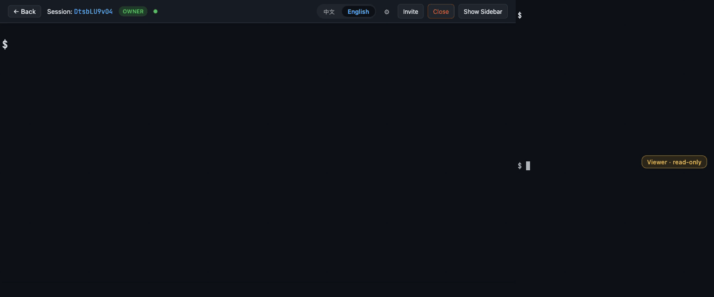

English | [简体中文](README.zh-CN.md)

# telepair

**Google Docs for your terminal.** Share terminal sessions with collaborators in real time, right from the browser.

telepair is an open-source web terminal collaboration tool. Run it on any machine, open a browser, and invite teammates to view, operate, or co-drive terminal sessions with fine-grained permissions.



## Features

- **Real-time collaboration** — multiple users in one terminal session with live output streaming
- **Role-based permissions** — Owner, Operator, and Viewer roles control who can type, resize, or just watch
- **Invite links** — share a link to let others join your session with a specific role
- **Virtual targets** — define named commands (SSH, psql, htop, etc.) as launchable targets via YAML config
- **Built-in chat** — sidebar chat alongside the terminal for coordination
- **Single binary** — one executable runs agent, control, and gateway in one process; clustering is planned future work
- **Web UI** — SolidJS frontend with xterm.js, no client install required

## Quick Start

### Prerequisites

- Rust 1.94+ (edition 2024)
- Node.js 18+

### Build

```bash
# Build the backend
cargo build --release

# Build the frontend
cd web && npm install && npm run build && cd ..
```

### Run

```bash
# Start telepair (all roles, default port 7700)
./target/release/telepair --web-dir web/dist
```

On first run, an admin user is created and a token is printed to the console:

```
INFO telepair: === First run: admin user created ===
INFO telepair: Admin token: <your-token>
INFO telepair: Save this token — it won't be shown again!
```

Open `http://localhost:7700` in your browser, paste the admin token to log in.

### Invite a collaborator

1. Launch a session from the dashboard by clicking a target
2. Click **Invite** in the top bar
3. Choose a role (Operator or Viewer) and copy the invite link
4. Share the link — the collaborator opens it and joins instantly; no token or account needed. A throwaway guest user is minted automatically on first click and their token is cached in the browser for the rest of the session.

## Architecture

telepair is a Cargo workspace with composable roles:

```
┌─────────────────────────────────────────────────┐
│                  telepair-cli                    │
│             (single binary entry point)          │
├────────────────┬────────────────┬────────────────┤
│  telepair-agent│telepair-control│telepair-gateway│
│  PTY management│  auth, sessions│  HTTP, WS, UI  │
│  virtual targets│  storage       │  API endpoints  │
├────────────────┴────────────────┴────────────────┤
│                  telepair-core                    │
│        types, traits, protocols, storage          │
└─────────────────────────────────────────────────┘
```

| Crate | Responsibility |
|-------|---------------|
| `telepair-core` | Shared types, Storage trait, protocol definitions, permissions |
| `telepair-agent` | PTY spawning via portable-pty, virtual target engine |
| `telepair-control` | Session lifecycle, target registry, auth service |
| `telepair-gateway` | Axum HTTP/WS server, REST API, static file serving |
| `telepair-cli` | CLI argument parsing, initialization, server startup |

### Deployment Shape

telepair today ships as a single-node binary: agent, control, and gateway run in the same process. Splitting them across hosts for clustering is planned future work — see `crates/telepair-cli/src/main.rs` for the (currently hidden) role flags.

## Configuration

### CLI Options

```
telepair [OPTIONS] [COMMAND]

Commands:
  admin    Admin operations (token recovery, user management)
           e.g. `telepair admin show-token` prints the saved admin token

Options:
      --host <HOST>                Server bind address [default: 0.0.0.0]
      --port <PORT>                Server port [default: 7700]
      --config <PATH>              Path to config file
      --targets <PATH>             Path to targets config [default: ~/.telepair/targets.yaml]
      --web-dir <PATH>             Path to web frontend dist directory
      --allowed-origins <LIST>     Comma-separated absolute-URL CORS allowlist.
                                   Unset defaults to loopback dev origins
                                   (http://localhost:5173, http://127.0.0.1:5173).
                                   Parse failures are fatal at startup.
      --allow-any-origin           Allow any origin (Access-Control-Allow-Origin: *).
                                   Only safe in dev or behind a CORS-enforcing proxy.
                                   Mutually exclusive with --allowed-origins (wins).
```

> Lost the admin token? Run `telepair admin show-token` — it reads the token cached in `~/.telepair/admin_token` (mode 0600, written once at first startup).

### Virtual Targets

Define named commands in `~/.telepair/targets.yaml`:

```yaml
targets:
  - name: production-db
    display: "Production DB"
    command: psql
    args: ["-h", "db.internal", "-U", "readonly", "production"]
    env:
      PGPASSWORD: "${PROD_DB_PASS}"
    tags: [database, production]

  - name: staging-ssh
    display: "Staging SSH"
    command: ssh
    args: ["deploy@staging.example.com"]
    admin_only: true
    tags: [server, staging]

  - name: monitor
    display: "System Monitor"
    command: htop
    tags: [monitoring]
```

Environment variables in `${VAR}` syntax are expanded at launch time. Set `admin_only: true` on a target to restrict session creation to admin users — non-admins hitting it receive `403 Forbidden`. A default local shell target is always available.

### Data Directory

telepair stores its data in `~/.telepair/`:

```
~/.telepair/
├── telepair.db       # SQLite database (users, sessions, participants, invites)
└── targets.yaml      # Virtual target definitions (optional)
```

## Permissions

| Capability | Owner | Operator | Viewer |
|-----------|-------|----------|--------|
| View terminal output | Yes | Yes | Yes |
| Type into terminal | Yes | Yes | No |
| Resize terminal | Yes | Yes | No |
| Send chat messages | Yes | Yes | Yes |
| Create invite links | Yes | No | No |
| Close session | Yes | No | No |

## Development

```bash
# Run backend tests (107 tests)
cargo test --workspace

# Run frontend unit tests (112 tests)
cd web && npm test

# Run browser E2E tests (36 tests, requires running server + Chromium)
cd web && npx playwright install chromium    # first time only
cd web && npm run e2e                        # server auto-starts or reuses :7700

# Type-check frontend
cd web && npm run type-check

# Dev mode: backend on :7700, frontend on :5173 with proxy
cargo run                          # terminal 1
cd web && npm run dev              # terminal 2
```

E2E tests use Playwright and require a built frontend (`npm run build`) and either a running telepair server on port 7700 or they auto-start one via `cargo run`. The admin token is read from `~/.telepair/admin_token`.

### Environment

```bash
# Adjust log level
RUST_LOG=debug ./target/release/telepair
```

## Documentation

| Document | Description |
|----------|-------------|
| [Architecture](docs/architecture.md) | Crate structure, data flow, broadcast channels, security model |
| [REST API](docs/api.md) | HTTP endpoint reference with request/response examples |
| [WebSocket Protocol](docs/protocol.md) | JSON message types, binary frame format, permission enforcement |
| [Deployment](docs/deployment.md) | Systemd, Docker, nginx reverse proxy, security checklist |
| [Contributing](CONTRIBUTING.md) | Development setup, code style, testing, PR workflow |

## Tech Stack

| Layer | Technology |
|-------|-----------|
| Backend | Rust, axum, tokio, sqlx (SQLite), portable-pty |
| Frontend | SolidJS, TypeScript, xterm.js, Vite |
| Protocol | JSON over WebSocket (control + collab), binary frames (terminal I/O) |
| Auth | Token-based with SHA-256 hashed storage |
| Storage | SQLite (async via sqlx) |

## License

[MIT](LICENSE)
